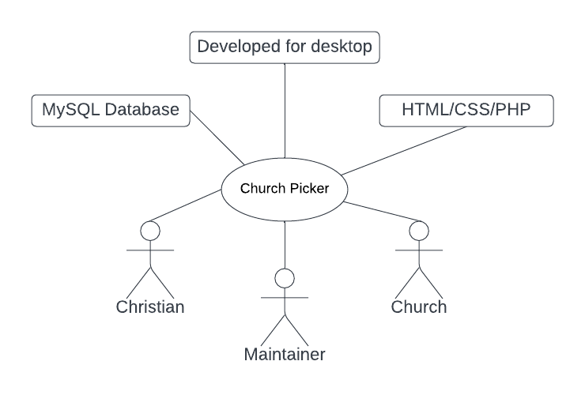

# Church Finder

## Business Case

### Problem statement
Church hopping is a problem for many christians and churches alike. Christians leave churches when they feel they are n ot aligned with the thinking of the leadership. Unfortunately, this isn't always apparent until time has been invested and relationships formed. My solution is a simple web app that helps christians to understand what they're looking for in a church, then see churches that are a potential match in their area.

### Business benefits
1. Users will be matched with churches they fit with, rather than choosing churches they think they fit with.
2. Churches will experience less of the negative impact of church hopping and pain inflicted on congregants as a result.

### Options Considered
1. Google maps shows churches in areas, with ratings, but it can be difficult to ascertain what a church is actually like.
2. There are church finder apps, but they work more on the user applying filters, when the problem is that some users don't know what they want.

### Expected Risks
1. It can be difficult to figure out a churches stance on some things as they prefer to keep it concealed as to not hinder someone that may actaully benefit from being there.
2. The scope of the project is large, as I would need to initially vet the data in alignment with my chosen categories/filters.

## Project Scope
1. create a database to store church data
2. vet local data and store in database
3. create a user friendly application
4. take user location
5. show matched churches on a map

