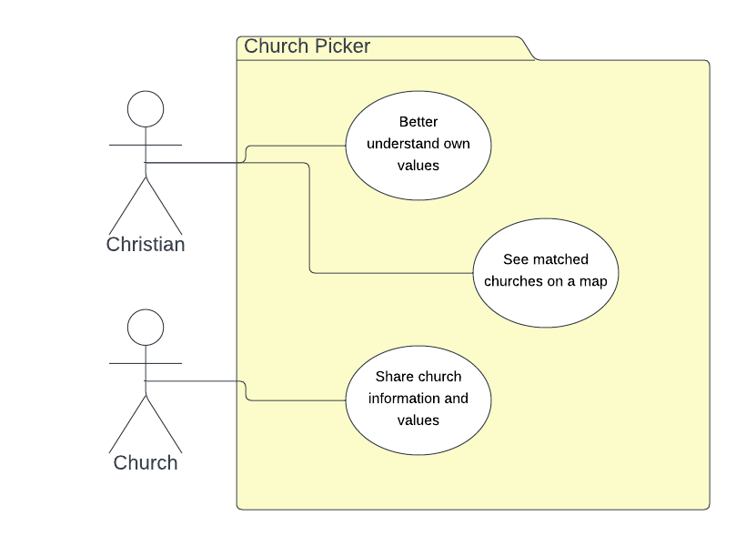

# Requirements

## User Needs

### Actors
Christian living in Bristol.
Local church in Bristol.

### User stories
Story 1: As a christian, I would like to understand where I stand on certain viewpoints and see if there are churches that hold to the same values.

Story 2: As a christian, I want to see if there are any churches in my area which match my values.  

Story 3: As a church, we want to add our church to the site to avoid the relational hurt of people coming and going due to misaligned values.  

### Use Cases

| UC1 | Better understand own values | 
| --- | ---------------------------------------- |
| **Description** | Answer a short series of questions to ascertain values |
| **Actors** | Christian |
| **Assumptions** | Christian wants to understand their views more to help them choose the right church</td></tr>
| **Steps** | <ol><li>Christian answers a short series of questions</li><li>System performs analysis of answers</li><li>System displays answers with analysis, explanation and matched churches</li></ol>|
| **Variations** | Christian would like more information on the views presented  - Could provide links to external articles for further reading |
| **Issues** | Questions would be limited, this may not be the most comprehensive analysis and may not draw out deeper issues |

| UC2 | See matched churches on a map | 
| --- | ------------------------------ |
| **Description** | See nearby churches on a map highlighting best matches |
| **Actors** | Christian |
| **Assumptions** | Christian wants to know if there are any matched churches in their area Christian may not want to choose the nearest best match |
| **Steps** | <ol><li>Christian selects to see matched churches on a map</li><li>System utilises data from database and mapping tool</li><li>System displays matched churches within adjustable radius</li><li>Christian clicks on a church to see more information and matching analysis</li></ol> |
| **Variations** | Christian may be looking for a church when travelling outside of Bristol  - Could provide links to other church finder sites (findachurch.co.uk & findachurch.com both agreed) |
| **Issues** | Initial data collection will be manual so will be working with a smaller dataset, may not get a good match |

| UC3 | Share church information and values | 
| --- | -------------------------------------- |
| **Description** | Use a signup page to add church to the site |
| **Actors** | Church |
| **Assumptions** | A church would like to add themselves to the site |
| **Steps** | <ol><li>Display a signup page</li><li>System displays a form with series of questions</li><li>Church will answer the questions and submit the form</li><li>Form submission triggers an email with form responses</li><li>Maintainer will manually add church to site</li></ol> |
| **Variations** | Could enable churches to add themselves with an approval function for maintainer Churches may want to update their data |
| **Issues** | Need to be selective of how churches can input data, security/validation if they are touching the database |

## Software Requirements Specification
### Functional requirements

* FR1: The system must ... (from UC?)
* FR2: The system must ... (from UC?)
* FR3: The system shall ... (from UC?)
* FR4: The system shall ... (from UC?)
* FR5: The system shall ... (from UC?)

### Non-Functional Requirements
* NFR1: The system must ... (from UC?)
* NFR2: The system shall ... (from UC?)
* NFR3: The system shall ... (from UC?)
