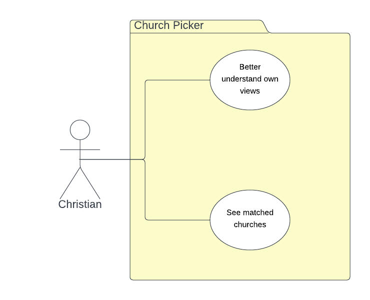

# Requirements

## User Needs

### Actors
Christian looking for a church to attend.

### User stories
Story 1: As a Christian, I would like to understand where I stand on certain viewpoints and see if there are churches that hold to the same values.

Story 2: As a christian, I want to see if there are any churches in my area which match my values.  

### Use Cases

| UC1 | Better understand own values | 
| --- | ---------------------------------------- |
| **Description** | Answer a short series of questions to ascertain values |
| **Actors** | Christian |
| **Assumptions** | Christian wants to understand their views more to help them choose the right church</td></tr>
| **Steps** | <ol><li>Christian answers a short series of questions</li><li>application performs analysis of answers</li><li>application displays answers with analysis, explanation and matched churches</li> <li>application returns answers efficiently</li></ol>|
| **Variations** | Christian would like more information on the views presented  - Could provide links to external articles for further reading |
| **Issues** | Questions would be limited, this may not be the most comprehensive analysis and may not draw out deeper issues |

| UC2 | See matched churches on a map | 
| --- | ------------------------------ |
| **Description** | See nearby churches on a map highlighting best matches |
| **Actors** | Christian |
| **Assumptions** | Christian wants to know if there are any matched churches in their area Christian may not want to choose the nearest best match |
| **Steps** | <ol><li>Christian selects to see matched churches on a map</li><li>application utilises data from database and mapping tool</li><li>application displays matched churches within adjustable radius</li><li>Christian clicks on a church to see more information and matching analysis</li></ol> |
| **Variations** | Christian may be looking for a church when travelling outside of the UK  - Could provide links to other church finder sites (findachurch.co.uk & findachurch.com both agreed) |
| **Issues** | Initial data collection will be manual so will be working with a smaller dataset, may not get a good match |

## Software Requirements Specification
### Functional requirements

* FR1: The application must ask the user a series of questions (from UC1)
* FR2: The application must analyse the user answers (from UC1)
* FR3: The application shall show recommended churches (from UC2)
* FR4: The application shall show non-recommended churches (from UC2)

### Non-Functional Requirements
* NFR1: The application return results within 5 seconds (from UC1)
* NFR2: The application shall be user friendly (from UC2)
